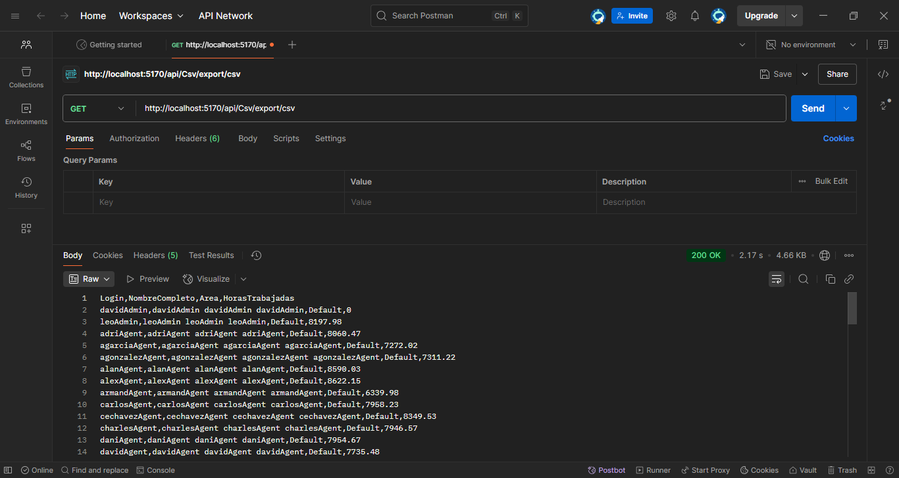

## 📁 Estructura del Repositorio

/LoginsAPI/

├── README.md

├── /sql/

│   ├── Consulta1.sql

│   ├── Consulta2.sql

│   └── Consulta3.sql 

├── /csv/
│   ├── ccUsers.csv
│   ├── ccloglogin.csv
│   └── ccRIACat_Areas.csv
├── /images/
│   └── postman_csv_example.png
├── /LoginsAPI/
│   ├── Controllers/
│   ├── Models/
│   ├── Program.cs
│   └── LoginsAPI.csproj

## ✅ Requisitos

* Docker
* .NET 8 SDK
* SQL Server Management Studio (SSMS), Azure Data Studio o similar
* Postman (u otra herramienta de pruebas de API)

# 📦 API de Logins y Exportación CSV

Este proyecto permite registrar inicios y cierres de sesión de usuarios, calcular el tiempo total logueado y exportar los datos en formato CSV mediante un endpoint de API.

---

## 🐳 Levantar SQL Server con Docker

1. Asegúrate de tener Docker instalado.
2. Ejecuta el siguiente comando para crear y levantar el contenedor:

   docker run -e 'ACCEPT_EULA=Y' -e 'SA_PASSWORD=YourStrong!Passw0rd' \
     -p 1433:1433 --name sqlserver -d mcr.microsoft.com/mssql/server:2019-latest
3. Espera unos segundos para que SQL Server se inicialice.
4. Inicia el contenedor docker.
5. Conéctate con tu herramienta preferida (SSMS, Azure Data Studio, etc.) usando:

   * **Servidor**: `localhost,1433`
   * **Usuario**: `sa`
   * **Contraseña**: `YourStrong!Passw0rd`
   * **Trust Server Certificate**: `True`

---

## ⚙️ Ejecutar la API

1. Abre el proyecto en **Visual Studio** o **VS Code**.
2. Ejecuta el proyecto (con `F5` o usando `dotnet run`).
3. La API estará disponible en:

   http://localhost:5170/swagger/
   
---

## 🗄️ Crear las Tablas con Entity Framework Core

1. Asegúrate de tener el contenedor SQL en funcionamiento.
2. Abre una terminal en la raíz del proyecto donde está el `.csproj`.
3. Ejecuta:

   dotnet ef migrations add InitialCreate
   dotnet ef database update
   

Esto generará la base de datos y las tablas en SQL Server basadas en los modelos del proyecto.

La cadena de conexión usada debe estar en `appsettings.json` así:

"ConnectionStrings": {
  "DefaultConnection": "Server=localhost,1433;Database=CCenterRIA;User Id=sa;Password=YourStrong!Passw0rd;TrustServerCertificate=True;"
}

---

## 🗃️ Cargar CSV desde Swagger
Se decidió hacer la carga de datos desde csv para hacer más sencilla la carga de los datos.
1. Ve a `http://localhost:5170/swagger/`
2. Usa el método **POST /api/Csv/import/csv**
3. Carga los siguientes archivos:

   * **Archivo**: `ccRIACat_Areas.csv` → **Nombre**: `ccRIACat_Areas`
   * **Archivo**: `ccUsers.csv` → **Nombre**: `ccUsers`
   * **Archivo**: `ccloglogin.csv` → **Nombre**: `ccloglogin`

Esto insertará los datos en sus respectivas tablas.

---

## 🧪 Probar los Endpoints

### 📥 GET `/api/Logins`

Retorna todos los registros de login/logout.

### ➕ POST `/api/Logins`

Agrega un nuevo registro. Campos requeridos:

* `User_id`: int
* `Extension`: int
* `TipoMov`: bool (true para login, false para logout)
* `Fecha`: datetime

Tome en cuenta que la fecha de registro no puede ser mayor a la del día actual, que no puede haber dos loguout o dos login
seguidos de un mismo usuario.

### ✏️ PUT `/api/Logins/{id}`

Modifica un registro existente por ID.

* Parámetro: `id` (int)
* Campos editables: `Extension`, `Fecha`

Tome en cuenta que se verificará que la fecha nueva no afecte a la congruencia de los 
login y los log outs. Si afecta, los cambios no se realizarán

### ❌ DELETE `/api/Logins/{id}`

Elimina un registro por ID y dependiendo si es login o si es logout, se eliminará el registro posterior de ese registro 
o el anterior de ese usuario respectivamente, sólo si ese otro registro existe.

---

## 📤 Descargar CSV con Postman

1. Abre Postman

2. Selecciona el método `GET`

3. Ingresa la URL:

   http://localhost:5170/api/Csv/export/csv
   

4. Presiona **Send**

5. El contenido CSV aparecerá en el body. Los headers deberían incluir:

  
   Content-Type: text/csv
   Content-Disposition: attachment; filename=reporte_logins.csv
   

---

## 🖼️ Vista del CSV en Postman

Si tienes una imagen de ejemplo en el repositorio, puedes incluirla así:

## 🗄️ Consultas solicitadas
Las consultas solicitadas se encuentran en la carpeta sql en donde hay 3 querys con lo siguiente:

1. Consulta del usuario que más tiempo ha estado logueado: - Escribe una consulta que devuelva el usuario que ha pasado más tiempo logueado. Para calcular el tiempo de logueo, empareja cada "login" (TipoMov = 1) con su correspondiente "logout" (TipoMov = 0) y suma el tiempo total por usuario.

2. Consulta del usuario que menos tiempo ha estado logueado: - Escribe una consulta similar a la anterior, pero que devuelva el usuario que ha pasado menos tiempo logueado.

3. Promedio de logueo por mes: - Escribe una consulta que calcule el tiempo promedio de logueo por usuario en cada mes.

